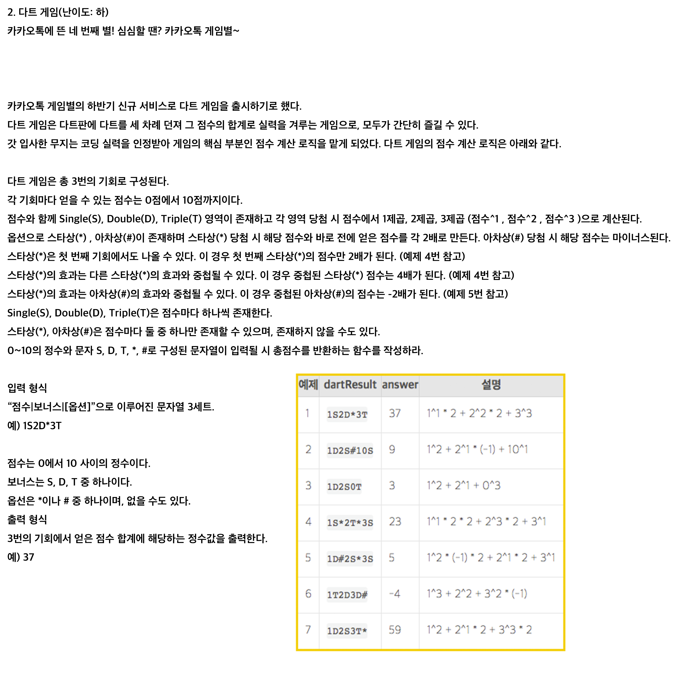

# Dart (kakao)


### My Solution

```js
function dart(arr) {
  let parsed = parser(arr);
  let sum = parsed.reduce((ac, cv) => {
    ac += cv.num;
    return ac;
  }, 0)
  return sum;
}
function parser(str) {
  let arr = [{}, {}, {}];
  str.match(/\d+/g).forEach((v, i) => {
    arr[i].num = +v;
  })
  str.match(/D|T|S/g).forEach((v, i) => {
    if (v === 'D') v = 2;
    if (v === 'S') v = 1;
    if (v === 'T') v = 3;
    arr[i].num = Math.pow(arr[i].num, v);
  })
  let count = 0;
  for (let i = 0; i < str.length; i++) {
    if (str[i] === 'S' || str[i] === 'D' || str[i] === 'T') {
      if (str[i + 1] === '*') {
        arr[count].num *= 2;
        if (count) arr[count - 1].num *= 2;
      }
      if (str[i + 1] === '#') {
        arr[count].num *= (-1);
      }
      count++;
    }
  }
  return arr;
}
console.log(dart('1S2D*3T'));
console.log(dart('1D2S#10S'));
console.log(dart('1D2S0T'));
console.log(dart('1S*2T*3S'));
console.log(dart('1D#2S*3S'));
console.log(dart('1T2D3D#'));
console.log(dart('1D2S3T*'));
```

### Other Solution

```js
const dartCount = list => {
  // let acc = 0, currentPoint;
  const normalCase = {
    S: n => n,
    D: n => n * n,
    T: n => n * n * n,
  };

  let acc = 0;
  const pointList = [];

  const splited = list.match(/\d+[^(0-9)]{1,2}/g);
  for (point of splited) {
    const currentNumber = point.match(/\d+/gi);
    const caculatesChar = point.match(/\D/gi);

    caculatesChar.forEach(v => {
      if (normalCase[v] !== undefined) {
        pointList.push(normalCase[v](+currentNumber));
      } else {
        if (v === "#") pointList[pointList.length - 1] *= -1;
        if (v === "*") {
          pointList[pointList.length - 1] *= 2;
          if (pointList.length >= 1) pointList[pointList.length - 2] *= 2;
        }
      }
    });
  }
  return pointList.reduce((ac, c) => ac + c);
};

console.log(dartCount("1D2S#10S"));
console.log(dartCount("1S2D*3T"));
console.log(dartCount("1D2S0T"));
console.log(dartCount("1S*2T*3S"));
```

