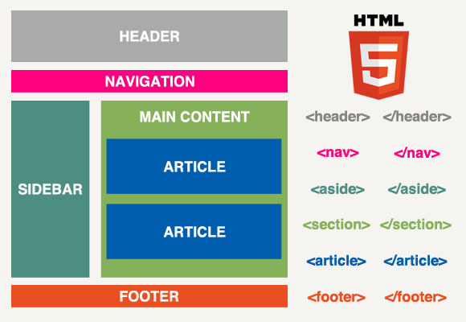

# 180619 TIL (HTML, CSS)

### HTML (HyperText Markup Language)

#### 레이아웃을 위한 태그

div랑 똑같은 일을 하는 block 엘리먼트이지만 의미를 부여할 수 있다

- nav
- article
- footer
- section
- aside

PC에서는 class에 nav나 article등 이름으로 사용을 하지만 모바일에서는 태그를 이용해 많이 사용한다


### HTML 구조화설계 (HTML Structure Design)

HTML을 그냥 짜는 것이 아니라 구조화 설계를 해야 한다



구조는 웹사이트마다 다르겠지만 이와 같은 구조로 짜는 것이 현재는 일반적이다


### ID와 Class

```html
<div id="container"></div>
<div class="our_description"></div>
```

위와 같은 방법으로 태그 안에 사용한다

ID는 고유한 값이다 한 개 이상 쓰더라도 오류가 나지는 않지만 의미상, 관례상 한 개만 쓰는 것을 꼭 지켜야 한다!

Class 같은 모양, 크기, 폰트, 여백 등 같은 형식을 가져야 하는 태그들에 같은 클래스를 적용한다

한 개의 클래스를 만들어 놓고 그것을 사용해야 하는 태그마다 클래스를 불러오는 방식이다


### 디버깅 - 크롬 - element탭

크롬 개발자 도구에 element탭을 잘 이용해야 한다

프론트엔드 개발자에게는 필수라고 한다

style항목을 이용하여 css속성을 바꾼 것을 화면에 바로바로 확인할 수 있다
