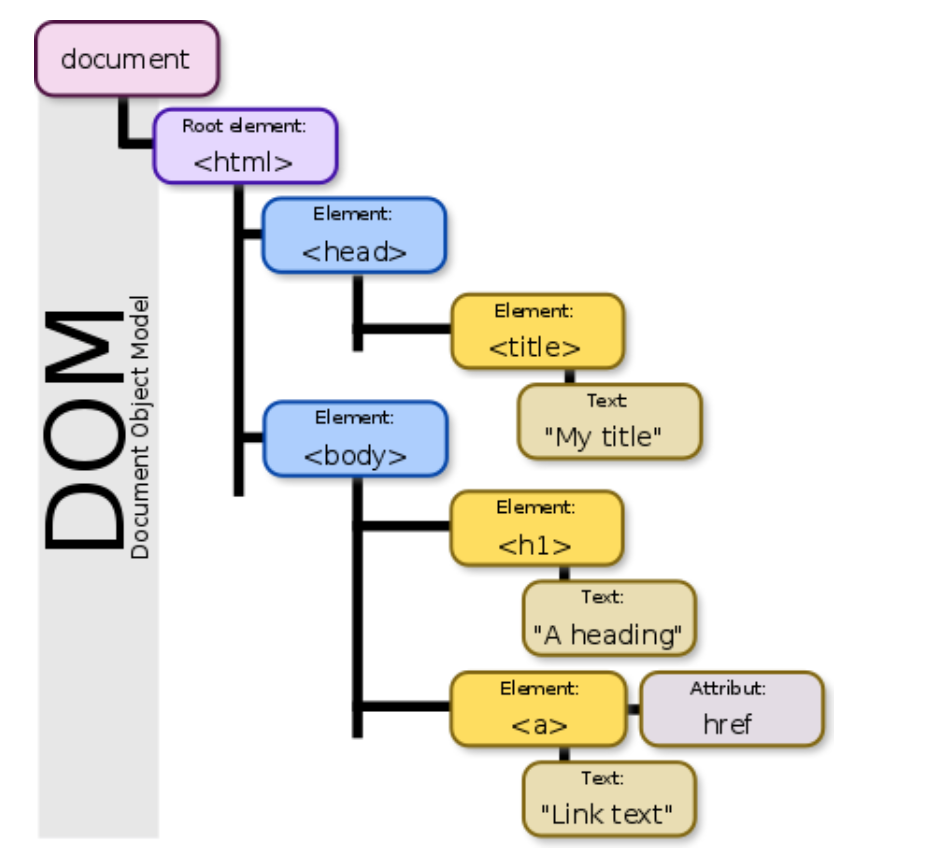

# 180621 TIL (DOM)

### DOM (Document Object Model) : 문서 객체 모델

웹 페이지는 일종의 문서(document)다 이 문서는 웹브라우저를 통해 그 내용이 해석되어

웹 브라우저 화면에 HTML소스 자체로 나타나기도 한다

DOM은 웹 페이지의 객체 지향 표현이며, 자바스크립트와 같은 스크립팅 언어를 이용해

DOM을 수정할 수 있다

넓은 의미로 웹 브라우저가 HTML페이지를 인식하는 방식이라고 볼 수 있다

조금 좁은 의미로는 document 객체와 관련된 객체의 집합이라고 할 수 있다

브라우저에 어떤 페이지를 load하면 DOM Structure 형태로 변환해준다!

HTML 문서의 모든 요소에 접근하는 방법을 정의한API라고 할 수 있다


</img>

DOM은 노드구조로 트리형태로 표현된다

node : 어떤 연결망에서 특정 지점과 지점을 연결하는데 표시한 것

이런 이유로 DOM구조를 node tree라고 한다 (node들의 집합)

하나의 root node에서 시작된다

나무와는 반대로 위에서 아래로 퍼져나가는 형태다

위쪽의 node를 parent노드, 노드 아래쪽의 node를 child노드라고 한다


### document.querySelector

CSS선택자를 이용하여 엘리먼트를 탐색하고 반환한다

```html
<style>
  .blue{
	color: blue;		    
  }
</style>
<body>
    <div>
        <p class="blue">Whale</p>
        <p class="blue">KillerWhale</p>
        <p class="blue">Dolphin</p>
    </div>
</body>
```


```js
const blue = document.querySelector('.blue');
blue.style.color = 'red';
```

querySelector는 탐색한 첫번째 element만 반환한다

따라서 div 하위의 첫번째 p엘리먼트 whale만 폰트가 빨간색으로 변한다

전체를 불러오기 원한다면 querySelectorAll을 이용하면 된다 querySelectorAll은

포함되는 모든 엘리먼트를 배열로 반환한다

```js
blue.forEach(v=>v.style.color='red');
```

와 같은 식으로 모든 p엘리먼트의 색을 빨간색으로 변화시킬 수 있을 것이다

