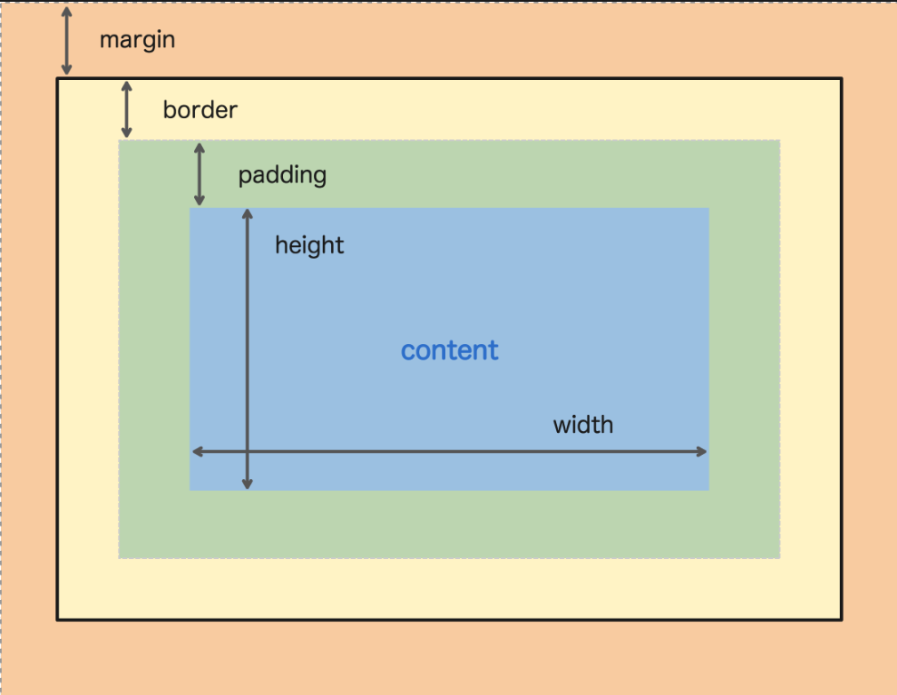

# 180627 TIL (HTML, CSS)

### CSS 기본 속성

#### Box Model

</img>

```css
.wrap {
    width: 100px;
    height: 100px;
    border: 1px solid slategray; /* 테두리 */
    margin: 20px; /* 다른 엘리먼트와의 거리 */
    padding: 10px 5px 10px 3px; /* border와 안의 내용과의 간격, top-right-bottom-left순, 모두 같다면 하나의 값만 입력하면 된다  */
}
```

margin의 특성

인접한 두 개의 block element가 서로 다른 margin을 가지고 있다면?

=> 큰 값을 가진 margin이 공유되어 사용됨

인접한 두 개의 inline element가 서로 다른 margin을 가지고 있다면?

=> 두 값이 합해진다


#### Position 속성을 이용한 Layout

- absolute
  부모 element중에 static이 아닌 element를 찾아 그 부모를 기준으로 배치된다
- relative
- fixed: 스크롤과 상관없이 고정된다


### HTML Templating 


