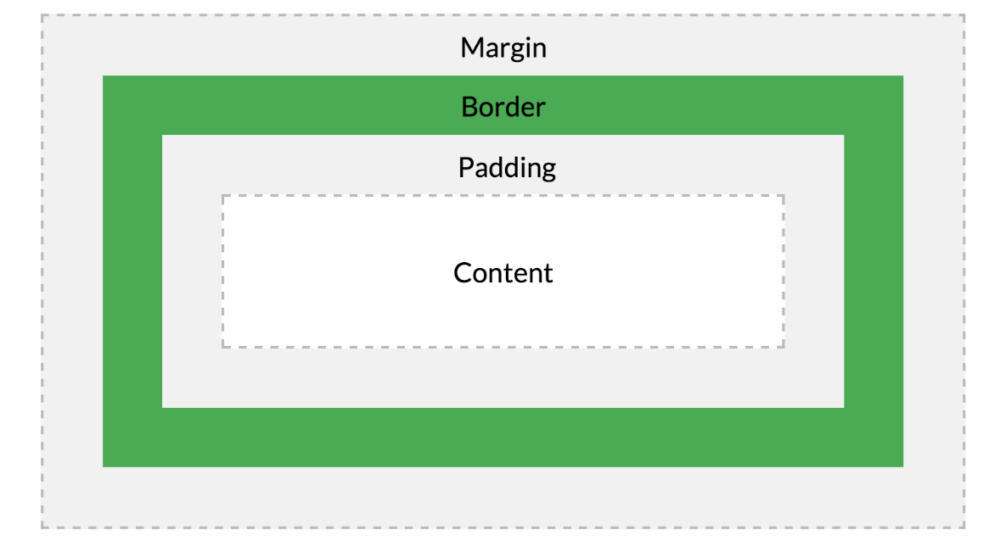
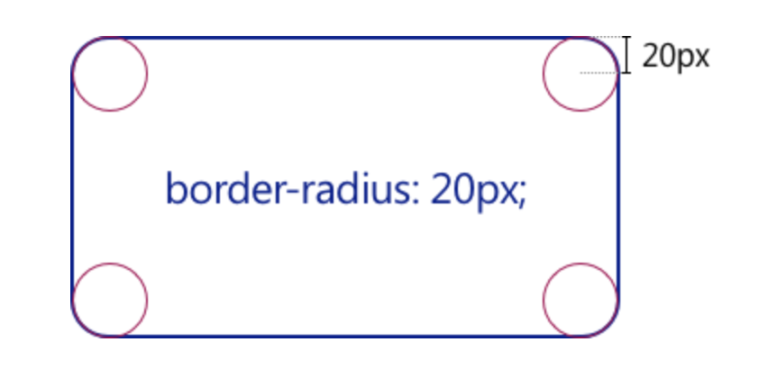

# 180919 TIL (Big-O, CSS Box Model)

## Honux offline algorithm lesson

### 복잡도(complexity) 분석

한 명이 사용하는 프로그램 개발은 쉽다

하지만 SNS처럼 수 억명의 사용자가 사용하는 프로그램은 개발하기 어렵다

그렇기에 알고리즘의 복잡도가 중요한 것이다

#### 공간복잡도

얼마나 많은 메모리를 적게 차지하는가

#### 시간복잡도

얼마나 빨리 실행되는가

#### Asymptotic notation

- 알고리즘 복잡도를 단순히 표현하기 위해 사용됨
- Big-O 표기법이 가장 유명

#### Big-O notation

- **최악의 성능을 의미 (최악의 성능을 보장해주는 것이다)**
- 

## CSS

poiemaweb을 보면서 공부했다

### Box model



**from poeimaweb**

Box는 Content, Padding, Border, Margin으로 구성된다

#### 1. width/height 프로퍼티

width와 height는 요소의 너비와 높이를 지정하기 위해 사용한다

이 때 지정되는 요소의 너비와 높이는 content영역을 대상으로 한다

Box-sizing 프로퍼티에 기본값이 content-box로 지정되었기 때문이다

Box-sizing에 border-box로 지정하면 padding과 border를 포함한 값을 너비와 높이로 지정할 수 있다! (새로 안 사실 뿌듯)

실제 컨텐츠가 width와 height로 지정해준 크기보다 커지면 밖으로 나오게 된다

이 때 overflow: hidden; 을 css에 추가해준다면 넘치는 부분은 잘려나가 보이게 한다

결과적으로는 전체 박스의 크기는 아래와 같이 계산된다

```
전체 너비
width + left padding + right padding + left border + right border + left margin + right margin
전체 높이
height + top padding + bottom padding + top border + bottom border + top margin + bottom margin
```

그리고 width와 height 프로퍼티를 비롯한 모든 박스모델 관련 프로퍼티(margin, padding, border, box-sizing 등)는 상속되지 않는다

#### 2. margin/padding 프로퍼티

- margin과 padding에는 left, right, top, bottom 4개의 방향에 대하여 값을 부여할 수 있다 (ex. margin:0px 2px 0px 19px) 값이 2px로 동일하면 margin: 2px로 생략가능
- 매우 중요한 사실 하나는 margin프로퍼티에 auto키워드를 설정하면 요소를 브라우저 중앙에 위치시킬 수 있다는 점이다 모르고 계속 썼었는데 더 자세히 알고 싶다!

#### 3. border 프로퍼티

##### radius



radius값을 저렇게 측정하는 것이었다는 사실을 알게 되었다!!!!!

##### `border` 프로퍼티는 `border-width`, `border-style`, `border-color`를 한번에 설정하기 위한 shorthand 프로퍼티이다.

#### 4. Box-sizing 프로퍼티

box-sizing 프로퍼티의 기본값은 content-box이다. 이는 width, height 프로퍼티의 대상 영역이 content 영역을 의미한다. box-sizing 프로퍼티의 값을 border-box로 지정하면 마진을 제외한 박스 모델 전체를 width, height 프로퍼티의 대상 영역으로 지정할 수 있어서 CSS Layout을 직관적으로 사용할 수 있게 한다.