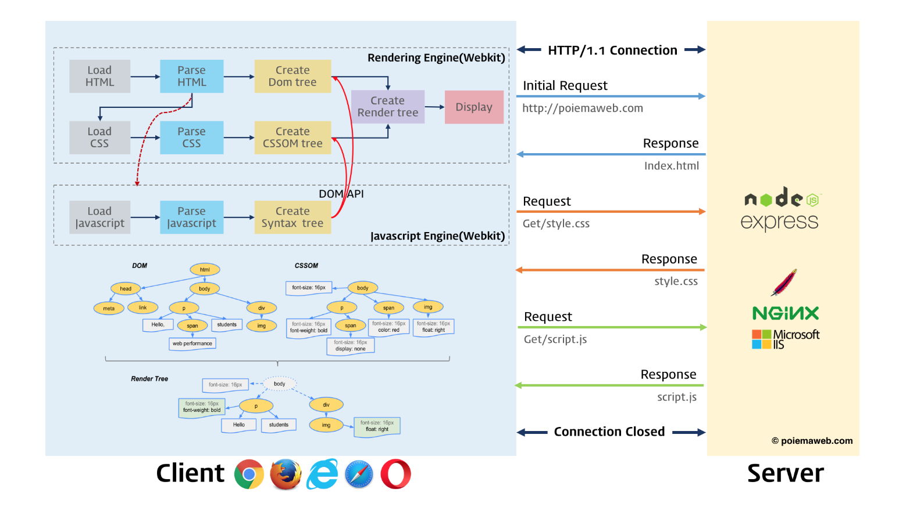

# 181129 TIL (PoiemaWeb JS 1-6, offlineLesson)

## 2장 브라우저 동작 원리

브라우저의 핵심 기능은 사용자가 참조하고자 하는 웹페이지를 서버에 요청하고

응답으로 HTML, CSS,  JS, IMG파일을 응답받는 것이다

HTML, CSS는 랜더링 엔진에 의해서, JS는 JS엔진에 의해서 파싱된다

</img>

HTML 파서는 `<script>`를 만나게 되면 파싱을 멈추고 권한을 JS엔진에 넘긴다

그러면 script에 있는 src의 경로에 정의된 JS파일을 로드하고 실행한다

그리고 그 작업이 완료되면 HTML파싱을 다시 시작한다

이처럼 브라우저는 동기적으로 HTML, CSS, JS를 처리한다

이것은 script의 위치에 따라서 블로킹이 발생할 수 있다는 것을 이야기한다

그렇기에 우리가 JS를 배울 때에 body가장 아래에 해주는 것이 좋다 라는 말이 나오는 것이다

body의 요소 가장 아래에 JS를 위치시키는 것은 좋은 아이디어다 아래와 같은 이점이 있기 때문이다

- HTML 요소들이 스크립트 로딩 지연으로 인해 랜더링에 지장을 받지 않음
- DOM 완성 전에 JS가 DOM을 조작하면 에러가 발생하기 때문

## 6장 데이터 타입과 변수

변수는 값의 위치(주소)를 기억하는 저장소다 값의 위치란 값이 위치하고 있는 메모리 상의

주소를 의미한다

즉 변수란, 값이 위치하고 있는 메모리 주소에 접근하기 위해 사람이 이해할 수 있는

언어로 명명한 식별자로 볼 수 있는 것이다

### JS의 타입

- 원시타입 (primitive data type)
  - boolean
  - null
  - undefined
  - number
  - string
  - Symbol (ES6)
- 객체 타입 (object/reference type)
  - object


#### 원시타입은 변경이 불가능하다 재할당이 가능할 뿐이다

```js
var str = 'hello';
str = 'world'
```

위와 같은 구문이 있을 때에 str의 주소에 있는 hello라는 data를 변경시키는 것이 아니라

새로운 주소에 world를 할당하게 되는 것이다

쓸모 없어진 것은 가비지컬렉터라고 하는 것이 수거하지 않을까 (?)

이처럼 변하지 않는 것을 immutable이라고 한다

```js
var str = 'whale';
console.log(str[0]) // w
str[0] = 'k';
console.log(str) // whale
```

배열처럼 인덱스로 str도 접근이 가능하다 (유사배열 이라고 함)

하지만 immutable이기에 값을 변경해도 변하지 않는다 에러는 나지 않음

#### undefined

undefined 타입의 값은 undefined가 유일하다

선언 이후에 값을 할당하지 않은 변수에는 undefined가 할당된다

변수 선언에 의해 확보된 메모리 공간을 처음 할당이 이루어지기 전까지는 garbage value

(쓰레기값)가 들어가 있다

이처럼 undefined는 개발자가 의도적으로 할당한 값이 아니라 자바스크립트 엔진에 의해 초기화된 값이다. 변수를 참조했을 때 undefined가 반환된다면 참조한 변수가 선언 이후 값이 할당된 적인 없는 변수라는 것을 개발자는 간파할 수 있다. 그렇다면 개발자가 의도적으로 undefined를 할당해야하는 경우가 있을까? 자바스크립트 엔진이 변수 초기화에 사용하는 이 값을 만약 개발자가 마음대로 할당한다면 undefined의 본래의 취지와 어긋날 뿐더러 혼란을 줄 수 있으므로 권장하지 않는다. 그럼 변수의 값이 없다는 것을 명시하고 싶은 경우 어떻게 하면 좋을까? 그런 경우는 undefined를 할당하는 것이 아니라 null을 할당한다


## Offline Lesson (쪽지 시험)

- 크로스 브라우징
  - CORS설정이 필요함, Header값에 추가해주면 간단히 해결할 수 있다
  - JSONP 다른 도메인 간에 이동
  - Polyfill 전략
- Promise 패턴의 오류처리
  원래 비동기에서 에러처리가 안되는데 catch를 이용하여 체이닝 중간에 일어나는
  에러를 잡는 것이 가능하다
  **오류처리를 잘 해야 한다**
- 비동기 함수 테스트
  - 콜백함수를 따로 유닛테스트
  - 이벤트를 인위적으로 발생시켜서 테스트
- Iterable Object
- setInterval

## Reference

- Poiema Web

